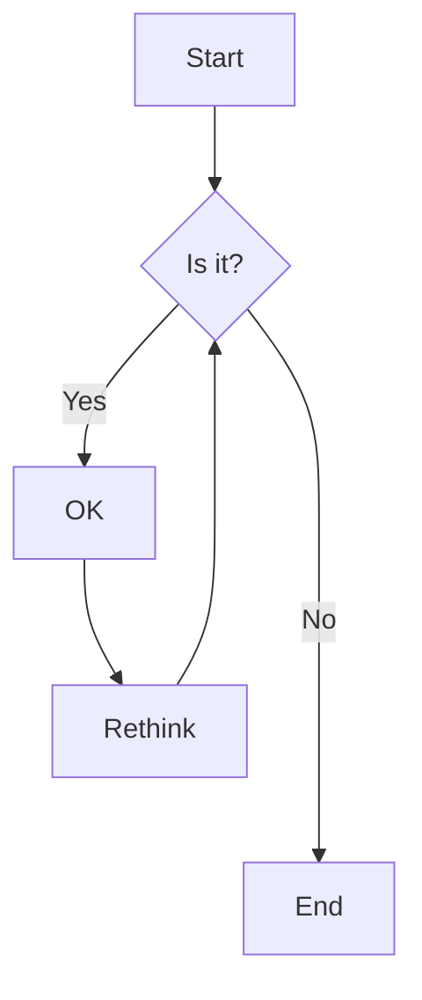
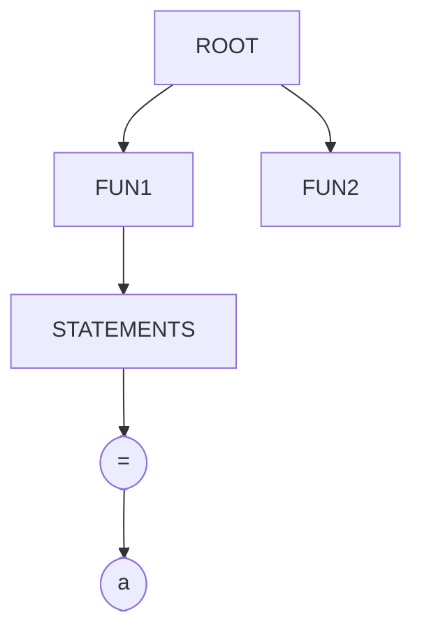
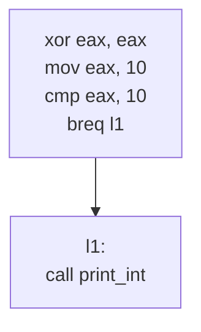

```mermaid
flowchart TD
    A[Start] --> B{Is it?}
    B -- Yes --> C[OK]
    C --> D[Rethink]
    D --> B
    B -- No ----> E[End]
```

```mermaid
flowchart TD
    X([a])
    ASSIGN([=])

    ROOT --> FUN1
    ROOT --> FUN2

    FUN1 --> STATEMENTS
    STATEMENTS --> ASSIGN
    ASSIGN --> X
```

```mermaid
flowchart TD
    B1["xor eax, eax 
mov eax, 10
cmp eax, 10
breq l1"]

B2["l1:
call print_int
"]
B1 --> B2
```