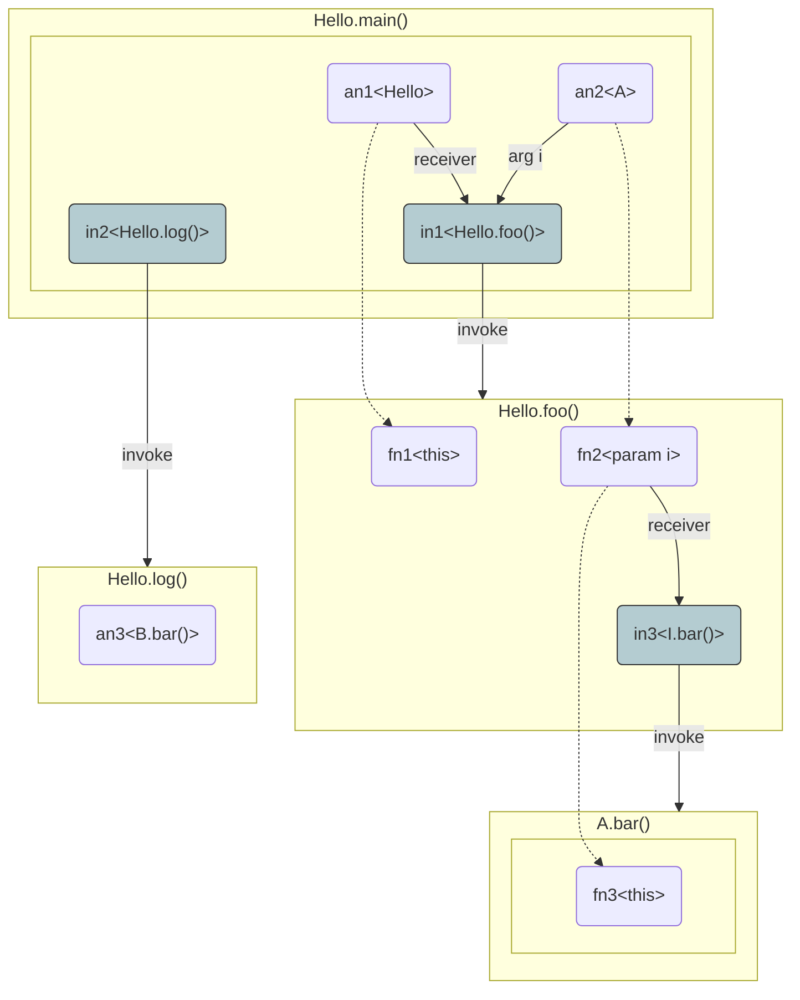

```mermaid
%% Mermaid markdown code for the figure
graph TB;
classDef invoke fill: #b4ccd1, stroke: #333, stroke-width: 1px;
classDef subgraph_padding fill:none, stroke: none %% title padding hack

subgraph main ["Hello.main()"]
subgraph subgraph_padding1 [ ]
in1("in1&lt;Hello.foo()&gt;"):::invoke
an1("an1&lt;Hello&gt;") -- receiver --> in1
an2("an2&lt;A&gt;") -- arg i --> in1
in2("in2&lt;Hello.log()&gt;"):::invoke
end
end

in1 -- invoke --> foo
an1 -..-> fn1
an2 -..-> fn2
subgraph foo ["Hello.foo()"]
fn1("fn1&lt;this&gt;")
fn2("fn2&lt;param i&gt;")
in3("in3&lt;I.bar()&gt;"):::invoke
fn2 -- receiver --> in3
end

in2 --invoke ---> log
subgraph log["Hello.log()"]
an3("an3&lt;B.bar()&gt;")

end

in3 -- invoke --> aBar
fn2 -..-> fn3
subgraph aBar["A.bar()"]
subgraph subgraph_padding2 [ ]
fn3("fn3&lt;this&gt;")
end
end

class subgraph_padding1 subgraph_padding
class subgraph_padding2 subgraph_padding
```