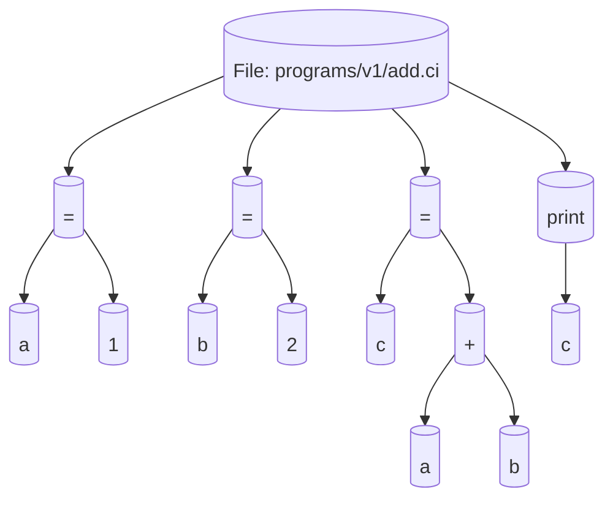

Code:

```
a = 1
b = 2
c = a + b
print c
```

Ast


```mermaid
flowchart TD
n1[(a)]
n2[(1)]
n3[(=)]
n4[(b)]
n5[(2)]
n6[(=)]
n7[(c)]
n8[(a)]
n9[(b)]
n10[(+)]
n11[(=)]
n12[(c)]
n13[(print)]
n14[(File: programs/v1/add.ci)]
n3 --> n1
n3 --> n2
n6 --> n4
n6 --> n5
n10 --> n8
n10 --> n9
n11 --> n7
n11 --> n10
n13 --> n12
n14 --> n3
n14 --> n6
n14 --> n11
n14 --> n13

```